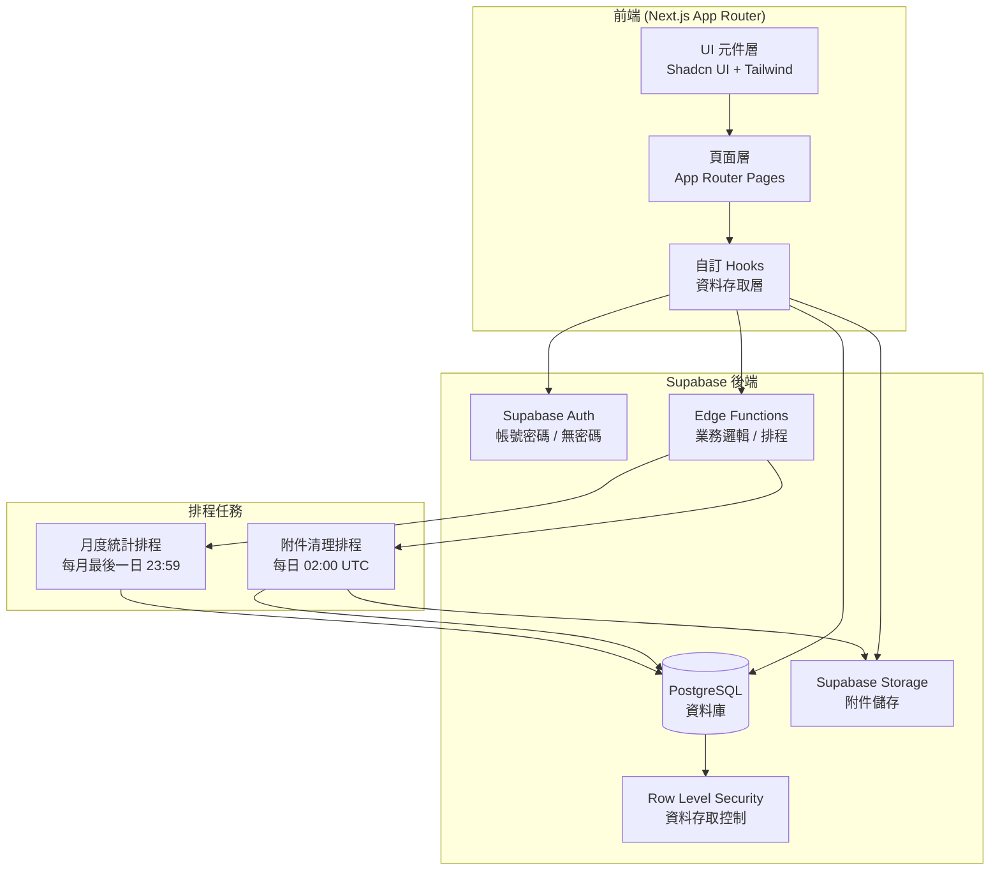
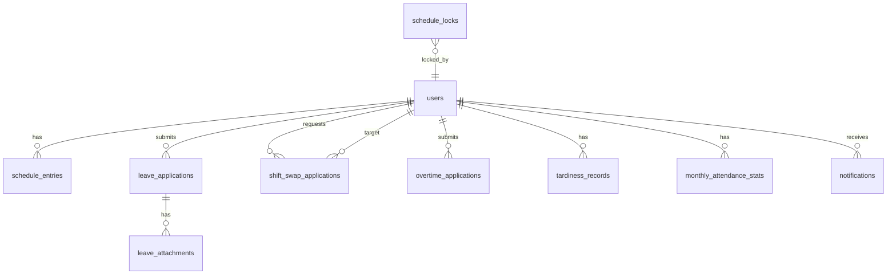

# Design Document: 耀聖藥局智慧排班系統

## Overview

耀聖藥局智慧排班系統是一套專為藥局設計的網頁排班管理平台，採用 Next.js + Supabase 技術棧。系統支援三種角色（老闆、店長、員工），提供排休選擇、班表管理、換班申請、請假申請、加班申請、工時統計、遲到管理及站內通知功能。

### 設計目標

- 以月曆介面呈現班表，直覺操作
- 依照藥局特定排班規則（月休配額、聖文特殊規則）自動驗證合規性
- 透過 Supabase RLS 確保資料隔離與角色存取控制
- 附件自動過期刪除（7 天），透過 Supabase Edge Function 排程執行
- 站內通知系統，不依賴外部推播服務

### 技術棧

| 層次 | 技術 |
|------|------|
| 前端框架 | Next.js 14 (App Router) |
| UI 元件 | Shadcn UI + Tailwind CSS |
| 後端服務 | Supabase (Auth, Database, Storage, Edge Functions) |
| 資料庫 | PostgreSQL (via Supabase) |
| 檔案儲存 | Supabase Storage |
| 排程任務 | Supabase Edge Functions (pg_cron) |

---

## Architecture

### 系統架構圖



### 角色與權限矩陣

| 功能 | 老闆 | 店長 | 員工 |
|------|------|------|------|
| 員工管理（新增/刪除） | ✅ | ❌ | ❌ |
| 查看完整班表 | ✅ | ✅ | ✅ |
| 編輯任意員工班表 | ✅ | ✅ | ❌ |
| 選擇本人排休 | ❌ | ❌ | ✅ |
| 班表鎖定/解鎖 | ✅ | ✅ | ❌ |
| 修改排班規則參數 | ✅ | ✅ | ❌ |
| 提交換班/請假/加班申請 | ❌ | ❌ | ✅ |
| 審核申請 | ✅ | ✅ | ❌ |
| 查看所有員工工時統計 | ✅ | ✅ | ❌ |
| 查看本人工時統計 | ❌ | ❌ | ✅ |
| 新增遲到紀錄 | ❌ | ✅ | ❌ |
| 查看遲到統計報表 | ✅ | ✅ | ❌ |
| 查看過去 12 個月遲到紀錄 | ✅ | ❌ | ❌ |

---

## Components and Interfaces

### 前端頁面架構

```
app/
├── (auth)/
│   └── login/
│       └── page.tsx              # 登入頁（帳密 + 員工下拉）
├── (dashboard)/
│   ├── layout.tsx                # 主版面（側邊欄 + 通知列）
│   ├── schedule/
│   │   ├── page.tsx              # 班表月曆主頁
│   │   └── [year]/[month]/
│   │       └── page.tsx          # 特定月份班表
│   ├── leave-selection/
│   │   └── page.tsx              # 員工排休選擇（直式介面）
│   ├── applications/
│   │   ├── leave/
│   │   │   ├── page.tsx          # 請假申請列表
│   │   │   └── new/page.tsx      # 新增請假申請
│   │   ├── shift-swap/
│   │   │   ├── page.tsx          # 換班申請列表
│   │   │   └── new/page.tsx      # 新增換班申請
│   │   └── overtime/
│   │       ├── page.tsx          # 加班申請列表
│   │       └── new/page.tsx      # 新增加班申請
│   ├── attendance/
│   │   ├── page.tsx              # 工時統計報表
│   │   └── tardiness/
│   │       └── page.tsx          # 遲到管理
│   ├── employees/
│   │   └── page.tsx              # 員工管理（老闆專用）
│   ├── notifications/
│   │   └── page.tsx              # 通知列表
│   └── settings/
│       └── page.tsx              # 排班規則參數設定
```

### 核心 UI 元件

```
components/
├── schedule/
│   ├── MonthlyCalendar.tsx       # 橫式月曆（班表查看）
│   ├── LeaveSelectionGrid.tsx    # 直式排休選擇格
│   ├── ShiftCell.tsx             # 單一班別格（含鎖定/警示狀態）
│   ├── StaffingAlert.tsx         # 人力缺口警示標示
│   └── LockControls.tsx          # 鎖定/解鎖控制元件
├── applications/
│   ├── LeaveForm.tsx             # 請假申請表單
│   ├── ShiftSwapForm.tsx         # 換班申請表單
│   ├── OvertimeForm.tsx          # 加班申請表單
│   └── ApplicationStatusBadge.tsx # 申請狀態標籤
├── attendance/
│   ├── MonthlyStatsTable.tsx     # 月度工時統計表
│   └── TardinessTable.tsx        # 遲到紀錄表
├── notifications/
│   ├── NotificationBell.tsx      # 通知鈴鐺（含未讀數）
│   └── NotificationList.tsx      # 通知列表
└── ui/                           # Shadcn UI 基礎元件
```

### Supabase Edge Functions

| Function 名稱 | 觸發方式 | 功能 |
|--------------|---------|------|
| `cleanup-expired-attachments` | pg_cron 每日 02:00 UTC | 刪除超過 168 小時的附件 |
| `calculate-monthly-stats` | pg_cron 每月最後一日 23:59 | 計算並儲存月度工時統計 |
| `send-notification` | Database Trigger / 直接呼叫 | 建立站內通知記錄 |

---

## Data Models

### 資料庫 Schema

#### `users` 表（擴充 Supabase Auth）

```sql
CREATE TABLE public.users (
  id          UUID PRIMARY KEY REFERENCES auth.users(id) ON DELETE CASCADE,
  name        VARCHAR(10) NOT NULL UNIQUE,
  role        VARCHAR(10) NOT NULL CHECK (role IN ('boss', 'manager', 'employee')),
  is_active   BOOLEAN NOT NULL DEFAULT TRUE,
  created_at  TIMESTAMPTZ NOT NULL DEFAULT NOW(),
  updated_at  TIMESTAMPTZ NOT NULL DEFAULT NOW()
);
```

> 老闆與店長透過 Supabase Auth 帳密登入，`id` 對應 `auth.users.id`。  
> 員工無密碼，透過特殊 Auth 流程（magic link 或 custom token）建立 session，`id` 同樣對應 `auth.users.id`。

#### `schedule_entries` 表（班表條目）

```sql
CREATE TABLE public.schedule_entries (
  id          UUID PRIMARY KEY DEFAULT gen_random_uuid(),
  user_id     UUID NOT NULL REFERENCES public.users(id),
  date        DATE NOT NULL,
  shift_code  VARCHAR(1) NOT NULL CHECK (shift_code IN ('A','B','C','D','E','X')),
  is_fixed    BOOLEAN NOT NULL DEFAULT FALSE,  -- 系統自動標記（週日、聖文週三/週二）
  created_by  UUID REFERENCES public.users(id),
  updated_by  UUID REFERENCES public.users(id),
  created_at  TIMESTAMPTZ NOT NULL DEFAULT NOW(),
  updated_at  TIMESTAMPTZ NOT NULL DEFAULT NOW(),
  UNIQUE (user_id, date)
);
```

#### `schedule_locks` 表（班表鎖定）

```sql
CREATE TABLE public.schedule_locks (
  id          UUID PRIMARY KEY DEFAULT gen_random_uuid(),
  lock_type   VARCHAR(10) NOT NULL CHECK (lock_type IN ('day', 'week', 'month')),
  lock_date   DATE,           -- lock_type = 'day' 時使用
  lock_year   SMALLINT,       -- lock_type = 'week' 或 'month' 時使用
  lock_week   SMALLINT,       -- lock_type = 'week' 時使用（ISO week）
  lock_month  SMALLINT,       -- lock_type = 'month' 時使用
  locked_by   UUID NOT NULL REFERENCES public.users(id),
  created_at  TIMESTAMPTZ NOT NULL DEFAULT NOW()
);
```

#### `scheduling_rules` 表（排班規則參數）

```sql
CREATE TABLE public.scheduling_rules (
  id                        UUID PRIMARY KEY DEFAULT gen_random_uuid(),
  monthly_leave_quota       SMALLINT NOT NULL DEFAULT 8,
  saturday_leave_quota      SMALLINT NOT NULL DEFAULT 2,
  weekday_leave_quota       SMALLINT NOT NULL DEFAULT 2,
  min_evening_staff         SMALLINT NOT NULL DEFAULT 2,
  updated_by                UUID REFERENCES public.users(id),
  updated_at                TIMESTAMPTZ NOT NULL DEFAULT NOW()
);
```

#### `leave_applications` 表（請假申請）

```sql
CREATE TABLE public.leave_applications (
  id              UUID PRIMARY KEY DEFAULT gen_random_uuid(),
  user_id         UUID NOT NULL REFERENCES public.users(id),
  leave_date      DATE NOT NULL,
  period          VARCHAR(10) NOT NULL CHECK (period IN ('full_day', 'morning', 'afternoon')),
  leave_type      VARCHAR(20) NOT NULL,  -- 事假、病假、特休等
  reason          VARCHAR(200) NOT NULL,
  status          VARCHAR(20) NOT NULL DEFAULT 'pending'
                  CHECK (status IN ('pending', 'approved', 'rejected')),
  reject_reason   VARCHAR(200),
  reviewed_by     UUID REFERENCES public.users(id),
  reviewed_at     TIMESTAMPTZ,
  created_at      TIMESTAMPTZ NOT NULL DEFAULT NOW(),
  updated_at      TIMESTAMPTZ NOT NULL DEFAULT NOW()
);
```

#### `leave_attachments` 表（請假附件）

```sql
CREATE TABLE public.leave_attachments (
  id              UUID PRIMARY KEY DEFAULT gen_random_uuid(),
  application_id  UUID NOT NULL REFERENCES public.leave_applications(id) ON DELETE CASCADE,
  storage_path    TEXT NOT NULL,          -- Supabase Storage 路徑
  file_name       TEXT NOT NULL,
  file_size       INTEGER NOT NULL,       -- bytes
  mime_type       VARCHAR(50) NOT NULL,
  status          VARCHAR(20) NOT NULL DEFAULT 'active'
                  CHECK (status IN ('active', 'expired', 'delete_failed')),
  uploaded_at     TIMESTAMPTZ NOT NULL DEFAULT NOW(),
  deleted_at      TIMESTAMPTZ
);
```

#### `shift_swap_applications` 表（換班申請）

```sql
CREATE TABLE public.shift_swap_applications (
  id              UUID PRIMARY KEY DEFAULT gen_random_uuid(),
  requester_id    UUID NOT NULL REFERENCES public.users(id),
  target_id       UUID NOT NULL REFERENCES public.users(id),
  swap_date       DATE NOT NULL,
  status          VARCHAR(20) NOT NULL DEFAULT 'pending_confirm'
                  CHECK (status IN ('pending_confirm', 'pending_review', 'approved', 'rejected')),
  reject_reason   VARCHAR(200),
  reviewed_by     UUID REFERENCES public.users(id),
  reviewed_at     TIMESTAMPTZ,
  created_at      TIMESTAMPTZ NOT NULL DEFAULT NOW(),
  updated_at      TIMESTAMPTZ NOT NULL DEFAULT NOW()
);
```

#### `overtime_applications` 表（加班申請）

```sql
CREATE TABLE public.overtime_applications (
  id              UUID PRIMARY KEY DEFAULT gen_random_uuid(),
  user_id         UUID NOT NULL REFERENCES public.users(id),
  overtime_date   DATE NOT NULL,
  start_time      TIME NOT NULL,
  end_time        TIME NOT NULL,
  reason          VARCHAR(200) NOT NULL,
  status          VARCHAR(20) NOT NULL DEFAULT 'pending'
                  CHECK (status IN ('pending', 'approved', 'rejected')),
  compensation    VARCHAR(10)
                  CHECK (compensation IN ('pay', 'comp_leave', NULL)),
  reject_reason   VARCHAR(200),
  reviewed_by     UUID REFERENCES public.users(id),
  reviewed_at     TIMESTAMPTZ,
  created_at      TIMESTAMPTZ NOT NULL DEFAULT NOW(),
  updated_at      TIMESTAMPTZ NOT NULL DEFAULT NOW()
);
```

#### `monthly_attendance_stats` 表（月度工時統計）

```sql
CREATE TABLE public.monthly_attendance_stats (
  id                  UUID PRIMARY KEY DEFAULT gen_random_uuid(),
  user_id             UUID NOT NULL REFERENCES public.users(id),
  year                SMALLINT NOT NULL,
  month               SMALLINT NOT NULL,
  work_days           SMALLINT NOT NULL DEFAULT 0,
  work_hours          NUMERIC(6,2) NOT NULL DEFAULT 0,
  overtime_hours      NUMERIC(6,2) NOT NULL DEFAULT 0,
  comp_leave_hours    NUMERIC(6,2) NOT NULL DEFAULT 0,
  leave_hours         NUMERIC(6,2) NOT NULL DEFAULT 0,
  calculated_at       TIMESTAMPTZ NOT NULL DEFAULT NOW(),
  UNIQUE (user_id, year, month)
);
```

#### `tardiness_records` 表（遲到紀錄）

```sql
CREATE TABLE public.tardiness_records (
  id              UUID PRIMARY KEY DEFAULT gen_random_uuid(),
  user_id         UUID NOT NULL REFERENCES public.users(id),
  record_date     DATE NOT NULL,
  minutes_late    SMALLINT NOT NULL CHECK (minutes_late BETWEEN 1 AND 999),
  note            TEXT,
  recorded_by     UUID NOT NULL REFERENCES public.users(id),
  created_at      TIMESTAMPTZ NOT NULL DEFAULT NOW(),
  UNIQUE (user_id, record_date)
);
```

#### `notifications` 表（站內通知）

```sql
CREATE TABLE public.notifications (
  id              UUID PRIMARY KEY DEFAULT gen_random_uuid(),
  recipient_id    UUID NOT NULL REFERENCES public.users(id),
  type            VARCHAR(50) NOT NULL,
  -- 類型：leave_submitted, leave_reviewed, shift_swap_requested,
  --       shift_swap_confirmed, shift_swap_reviewed, overtime_submitted,
  --       overtime_reviewed, schedule_changed
  title           VARCHAR(100) NOT NULL,
  body            TEXT NOT NULL,
  related_id      UUID,           -- 關聯的申請 ID
  related_type    VARCHAR(30),    -- 'leave' | 'shift_swap' | 'overtime' | 'schedule'
  is_read         BOOLEAN NOT NULL DEFAULT FALSE,
  created_at      TIMESTAMPTZ NOT NULL DEFAULT NOW()
);
```

### 資料關聯圖



### 班別時數對照表

| 班別代碼 | 名稱 | 時數 |
|---------|------|------|
| A | 全天班 | 8.0 |
| B | 白班 | 4.0 |
| C | 下午班 | 4.0 |
| D | 晚班 | 4.0 |
| E | 下午+晚班 | 8.0 |
| X | 排休 | 0.0 |

---

## Correctness Properties


*A property is a characteristic or behavior that should hold true across all valid executions of a system — essentially, a formal statement about what the system should do. Properties serve as the bridge between human-readable specifications and machine-verifiable correctness guarantees.*

### Property 1: 角色權限隔離

*For any* 使用者角色和任意系統操作，若該操作超出該角色的權限範圍，系統應拒絕執行並回傳權限不足的錯誤，且不對資料庫產生任何副作用。

**Validates: Requirements 1.7**

---

### Property 2: 員工資料隔離

*For any* 以員工身份登入的使用者，查詢個人資料、申請紀錄或工時統計時，回傳結果中不應包含任何其他員工的資料。

**Validates: Requirements 1.8**

---

### Property 3: 員工姓名長度驗證

*For any* 字串作為員工姓名輸入，長度介於 1 至 10 個字元的字串應被接受，長度為 0 或超過 10 個字元的字串應被拒絕，且系統狀態保持不變。

**Validates: Requirements 2.1**

---

### Property 4: 員工姓名唯一性

*For any* 已存在於系統中的員工姓名，嘗試以相同姓名新增員工時，系統應拒絕操作，員工總數保持不變。

**Validates: Requirements 2.2**

---

### Property 5: 刪除員工保留歷史紀錄

*For any* 員工及其關聯的歷史班表、請假申請、換班申請、加班申請紀錄，刪除該員工後，所有歷史紀錄應仍可被查詢，且資料完整性不受影響。

**Validates: Requirements 2.4**

---

### Property 6: 排休配額上限

*For any* 員工和任意月份，週六排休選取次數不得超過 2 天，平日排休選取次數不得超過 2 天；嘗試超過配額的選取操作應被拒絕，且已選取的排休狀態保持不變。

**Validates: Requirements 3.3, 3.4, 3.5, 3.6**

---

### Property 7: 聖文固定班規則

*For any* 包含週二或週三的月份，聖文的週三班別代碼應為 X（排休）且標記為 is_fixed=true，週二班別代碼應為 B（白班）且標記為 is_fixed=true；任何嘗試修改這些固定班別的操作應被拒絕。

**Validates: Requirements 3.7, 3.8, 3.9**

---

### Property 8: 晚班人力警示狀態

*For any* 日期和對應的班表配置，晚班人數為 0 時應顯示紅色缺口警示，晚班人數為 1 時應顯示黃色警告，晚班人數恰好為 2 時無警示，晚班人數超過 2 時應顯示藍色提示；警示狀態應與實際晚班人數嚴格對應。

**Validates: Requirements 4.4, 4.5, 4.6, 4.7**

---

### Property 9: 班表鎖定不可修改性

*For any* 已被鎖定的日期、週次或月份範圍，員工嘗試修改該範圍內任意班別的操作應被拒絕，且班表資料保持鎖定前的狀態不變。

**Validates: Requirements 5.4, 5.5**

---

### Property 10: 換班申請狀態機

*For any* 換班申請，其狀態轉換必須嚴格遵循以下路徑：
- 提交後 → `pending_confirm`
- 員工B確認 → `pending_review`
- 員工B拒絕 → `rejected`
- 店長核准 → `approved`（並自動更新班表）
- 店長拒絕 → `rejected`

任何不符合此狀態機的轉換操作應被拒絕，且每次狀態轉換應觸發對應的站內通知。

**Validates: Requirements 6.2, 6.3, 6.4, 6.5, 6.6**

---

### Property 11: 請假日期不得早於今日

*For any* 請假申請，若申請的請假日期早於提交當日，系統應拒絕提交，且不建立任何請假紀錄。

**Validates: Requirements 7.2**

---

### Property 12: 附件格式與大小驗證

*For any* 上傳的附件，MIME type 不屬於 `image/jpeg`、`image/png`、`application/pdf` 之一，或檔案大小超過 10 MB（10,485,760 bytes），系統應拒絕上傳並回傳具體失敗原因，且不在 Storage 中建立任何物件。

**Validates: Requirements 7.3, 12.1**

---

### Property 13: 加班時間區間驗證

*For any* 加班申請，若結束時間不晚於起始時間，系統應拒絕提交；若加班日期早於申請當日 7 天以前或晚於申請當日 30 天以後，系統應拒絕提交；兩種情況均不建立任何加班紀錄。

**Validates: Requirements 8.2, 8.3**

---

### Property 14: 加班時段不重疊

*For any* 員工在同一日期的兩筆加班申請，若兩個時段存在任何重疊（包含邊界相接），第二筆申請應被拒絕，且第一筆申請的狀態保持不變。

**Validates: Requirements 8.4**

---

### Property 15: 遲到紀錄唯一性

*For any* 員工和日期組合，若該組合已存在遲到紀錄，嘗試新增第二筆遲到紀錄應被拒絕，且現有紀錄保持不變。

**Validates: Requirements 10.2**

---

### Property 16: 附件自動過期刪除

*For any* 上傳時間超過 168 小時（7 天）的附件，執行清理排程後，該附件應從 Supabase Storage 中被刪除，且對應的 `leave_attachments` 紀錄狀態應更新為 `expired`，同時關聯的請假申請紀錄本身保持完整。

**Validates: Requirements 12.3**

---

### Property 17: 附件刪除失敗重試

*For any* 清理排程執行時刪除失敗的附件，該附件應保留在 Storage 中，其狀態應更新為 `delete_failed`，且在下次排程執行時應重新嘗試刪除。

**Validates: Requirements 12.5**

---

## Error Handling


### 錯誤分類與處理策略

| 錯誤類型 | HTTP 狀態碼 | 處理方式 | 使用者提示 |
|---------|------------|---------|-----------|
| 驗證錯誤（輸入不合規） | 400 | 前端即時驗證 + 後端 RLS 拒絕 | 顯示具體欄位錯誤訊息 |
| 權限不足 | 403 | RLS Policy 拒絕 | 「權限不足」提示 |
| 資源不存在 | 404 | 前端導向 404 頁面 | 「找不到資料」提示 |
| 業務規則衝突 | 409 | 後端驗證函式回傳 | 顯示具體衝突原因 |
| 檔案上傳失敗 | 422 | Storage 回傳錯誤碼 | 顯示格式/大小/其他錯誤 |
| 伺服器錯誤 | 500 | 記錄至 Supabase Logs | 「系統錯誤，請稍後再試」 |

### 關鍵業務規則驗證

所有業務規則驗證採用**雙層防護**：

1. **前端即時驗證**：使用 React Hook Form + Zod schema，在使用者輸入時即時回饋，減少無效請求。
2. **後端 RLS + Database Constraints**：即使前端驗證被繞過，資料庫層仍會拒絕不合規的操作。

```typescript
// 前端 Zod Schema 範例（請假申請）
const leaveApplicationSchema = z.object({
  leave_date: z.date().min(new Date(), { message: '請假日期不得早於今日' }),
  period: z.enum(['full_day', 'morning', 'afternoon']),
  leave_type: z.string().min(1),
  reason: z.string().max(200, { message: '事由最多 200 字' }),
});
```

### 附件清理排程錯誤處理

```typescript
// Edge Function: cleanup-expired-attachments
async function cleanupExpiredAttachments() {
  const expiredAttachments = await getExpiredAttachments(); // 超過 168 小時
  
  for (const attachment of expiredAttachments) {
    try {
      await supabase.storage.from('leave-attachments').remove([attachment.storage_path]);
      await updateAttachmentStatus(attachment.id, 'expired');
    } catch (error) {
      // 刪除失敗：更新狀態為 delete_failed，下次排程重試
      await updateAttachmentStatus(attachment.id, 'delete_failed');
      await logCleanupFailure(attachment.id, error.message);
    }
  }
}
```

---

## Testing Strategy

### 測試架構

本系統採用雙層測試策略：

1. **單元測試 / 屬性測試**：驗證業務邏輯函式的正確性
2. **整合測試**：驗證 Supabase RLS、Edge Functions 與前端的整合

### 屬性測試（Property-Based Testing）

使用 **fast-check**（TypeScript/JavaScript PBT 函式庫）進行屬性測試。

```bash
npm install --save-dev fast-check
```

每個屬性測試配置最少 **100 次迭代**。

#### 屬性測試範例

```typescript
// Property 6: 排休配額上限
import * as fc from 'fast-check';
import { validateLeaveSelection } from '@/lib/scheduling/rules';

test('Feature: yaosheng-pharmacy-scheduling, Property 6: 排休配額上限', () => {
  fc.assert(
    fc.property(
      fc.record({
        employeeId: fc.uuid(),
        year: fc.integer({ min: 2024, max: 2030 }),
        month: fc.integer({ min: 1, max: 12 }),
        saturdaySelections: fc.array(fc.integer({ min: 1, max: 5 }), { minLength: 3, maxLength: 5 }),
      }),
      ({ employeeId, year, month, saturdaySelections }) => {
        const result = validateLeaveSelection({
          employeeId,
          year,
          month,
          saturdayCount: saturdaySelections.length,
        });
        // 超過 2 天週六排休應被拒絕
        expect(result.valid).toBe(false);
        expect(result.error).toContain('週六排休已達上限');
      }
    ),
    { numRuns: 100 }
  );
});
```

```typescript
// Property 13: 加班時間區間驗證
test('Feature: yaosheng-pharmacy-scheduling, Property 13: 加班時間區間驗證', () => {
  fc.assert(
    fc.property(
      fc.record({
        start_time: fc.string({ minLength: 5, maxLength: 5 }).filter(s => /^\d{2}:\d{2}$/.test(s)),
        end_time: fc.string({ minLength: 5, maxLength: 5 }).filter(s => /^\d{2}:\d{2}$/.test(s)),
      }).filter(({ start_time, end_time }) => end_time <= start_time),
      ({ start_time, end_time }) => {
        const result = validateOvertimeApplication({ start_time, end_time });
        expect(result.valid).toBe(false);
        expect(result.error).toContain('結束時間必須晚於起始時間');
      }
    ),
    { numRuns: 100 }
  );
});
```

### 單元測試

使用 **Vitest** 進行單元測試，聚焦於：

- 排班規則引擎（月休配額計算、聖文特殊規則）
- 人力缺口警示邏輯
- 工時統計計算
- 附件驗證邏輯

```typescript
// 單元測試範例：聖文特殊規則
describe('聖文特殊規則', () => {
  it('應自動將聖文週三標記為固定排休', () => {
    const entries = generateMonthlyEntries('聖文', 2025, 1);
    const wednesdays = entries.filter(e => new Date(e.date).getDay() === 3);
    wednesdays.forEach(e => {
      expect(e.shift_code).toBe('X');
      expect(e.is_fixed).toBe(true);
    });
  });

  it('應自動將聖文週二標記為白班', () => {
    const entries = generateMonthlyEntries('聖文', 2025, 1);
    const tuesdays = entries.filter(e => new Date(e.date).getDay() === 2);
    tuesdays.forEach(e => {
      expect(e.shift_code).toBe('B');
      expect(e.is_fixed).toBe(true);
    });
  });
});
```

### 整合測試

使用 **Supabase 本地開發環境**（`supabase start`）進行整合測試：

- RLS Policy 驗證（各角色的資料存取隔離）
- Edge Function 測試（附件清理、月度統計計算）
- 換班申請狀態機流程測試

### 測試覆蓋目標

| 測試類型 | 目標覆蓋率 | 工具 |
|---------|-----------|------|
| 業務邏輯單元測試 | ≥ 80% | Vitest |
| 屬性測試（17 個屬性） | 100%（每個屬性 ≥ 100 次迭代） | fast-check |
| RLS 整合測試 | 所有角色 × 所有資料表 | Supabase CLI |
| Edge Function 測試 | 100%（含錯誤路徑） | Deno Test |

---

## Security Design

### Row Level Security (RLS) 政策

#### `users` 表

```sql
-- 所有登入使用者可查看使用者列表（用於下拉選單）
CREATE POLICY "users_select_all" ON public.users
  FOR SELECT USING (auth.role() = 'authenticated');

-- 只有老闆可新增/刪除員工
CREATE POLICY "users_insert_boss_only" ON public.users
  FOR INSERT WITH CHECK (
    EXISTS (SELECT 1 FROM public.users WHERE id = auth.uid() AND role = 'boss')
  );

CREATE POLICY "users_delete_boss_only" ON public.users
  FOR DELETE USING (
    EXISTS (SELECT 1 FROM public.users WHERE id = auth.uid() AND role = 'boss')
  );
```

#### `schedule_entries` 表

```sql
-- 所有登入使用者可查看班表
CREATE POLICY "schedule_select_all" ON public.schedule_entries
  FOR SELECT USING (auth.role() = 'authenticated');

-- 老闆和店長可編輯任意班表
CREATE POLICY "schedule_update_manager" ON public.schedule_entries
  FOR UPDATE USING (
    EXISTS (SELECT 1 FROM public.users WHERE id = auth.uid() AND role IN ('boss', 'manager'))
  );

-- 員工只能修改自己的非固定班別（排休選擇）
CREATE POLICY "schedule_update_employee_self" ON public.schedule_entries
  FOR UPDATE USING (
    user_id = auth.uid() AND is_fixed = FALSE
  );
```

#### `leave_applications` 表

```sql
-- 員工只能查看自己的請假申請
CREATE POLICY "leave_select_own" ON public.leave_applications
  FOR SELECT USING (
    user_id = auth.uid() OR
    EXISTS (SELECT 1 FROM public.users WHERE id = auth.uid() AND role IN ('boss', 'manager'))
  );

-- 員工只能提交自己的請假申請
CREATE POLICY "leave_insert_own" ON public.leave_applications
  FOR INSERT WITH CHECK (user_id = auth.uid());

-- 只有老闆和店長可審核（更新狀態）
CREATE POLICY "leave_update_manager" ON public.leave_applications
  FOR UPDATE USING (
    EXISTS (SELECT 1 FROM public.users WHERE id = auth.uid() AND role IN ('boss', 'manager'))
  );
```

#### `notifications` 表

```sql
-- 使用者只能查看自己的通知
CREATE POLICY "notifications_select_own" ON public.notifications
  FOR SELECT USING (recipient_id = auth.uid());

-- 使用者只能更新自己的通知（標記已讀）
CREATE POLICY "notifications_update_own" ON public.notifications
  FOR UPDATE USING (recipient_id = auth.uid());
```

### 員工無密碼登入設計

員工（佾珊、宜孝、貞葶、聖文、桂香）採用無密碼登入，實作方式：

1. 老闆在後台為每位員工建立 Supabase Auth 帳號（使用虛擬 email，如 `lisan@yaosheng.internal`）
2. 員工登入時，前端呼叫 Supabase Edge Function，由 Edge Function 使用 Service Role Key 為員工建立 session
3. Edge Function 驗證員工姓名存在於 `users` 表且 `is_active = true`
4. 回傳 JWT token 給前端，前端儲存至 cookie

```typescript
// Edge Function: employee-login
export async function employeeLogin(employeeName: string) {
  const employee = await supabase
    .from('users')
    .select('id, name, role')
    .eq('name', employeeName)
    .eq('role', 'employee')
    .eq('is_active', true)
    .single();

  if (!employee) throw new Error('員工不存在');

  // 使用 Service Role 建立 session
  const { data } = await supabaseAdmin.auth.admin.createSession({
    user_id: employee.id,
  });

  return data.session;
}
```

### 班表鎖定驗證

班表鎖定在資料庫層透過 PostgreSQL Function 驗證：

```sql
CREATE OR REPLACE FUNCTION is_date_locked(check_date DATE)
RETURNS BOOLEAN AS $$
BEGIN
  RETURN EXISTS (
    SELECT 1 FROM public.schedule_locks
    WHERE
      (lock_type = 'day' AND lock_date = check_date) OR
      (lock_type = 'week' AND lock_year = EXTRACT(YEAR FROM check_date)
        AND lock_week = EXTRACT(WEEK FROM check_date)) OR
      (lock_type = 'month' AND lock_year = EXTRACT(YEAR FROM check_date)
        AND lock_month = EXTRACT(MONTH FROM check_date))
  );
END;
$$ LANGUAGE plpgsql SECURITY DEFINER;
```

---

## Key Business Logic

### 排班規則引擎

排班規則引擎負責驗證排休選擇的合規性，實作為純函式以便測試：

```typescript
// lib/scheduling/rules.ts

export interface LeaveSelectionContext {
  employeeId: string;
  employeeName: string;
  year: number;
  month: number;
  existingSaturdayLeaves: number;
  existingWeekdayLeaves: number;
  targetDate: Date;
  rules: SchedulingRules;
}

export function validateLeaveSelection(ctx: LeaveSelectionContext): ValidationResult {
  const dayOfWeek = ctx.targetDate.getDay(); // 0=日, 1=一, ..., 6=六

  // 聖文特殊規則
  if (ctx.employeeName === '聖文') {
    if (dayOfWeek !== 6) { // 非週六
      return { valid: false, error: '聖文僅能選取週六排休' };
    }
  }

  // 週六配額檢查
  if (dayOfWeek === 6) {
    if (ctx.existingSaturdayLeaves >= ctx.rules.saturday_leave_quota) {
      return { valid: false, error: `週六排休已達上限（${ctx.rules.saturday_leave_quota}天）` };
    }
    return { valid: true };
  }

  // 平日配額檢查（週一至週五）
  if (dayOfWeek >= 1 && dayOfWeek <= 5) {
    if (ctx.existingWeekdayLeaves >= ctx.rules.weekday_leave_quota) {
      return { valid: false, error: `平日排休已達上限（${ctx.rules.weekday_leave_quota}天）` };
    }
    return { valid: true };
  }

  // 週日為固定排休，不可手動選取
  return { valid: false, error: '週日為固定排休，無需選取' };
}
```

### 人力缺口計算

```typescript
// lib/scheduling/staffing.ts

export type StaffingStatus = 'critical' | 'warning' | 'normal' | 'excess';

export function calculateEveningStaffingStatus(
  eveningStaffCount: number,
  minRequired: number
): StaffingStatus {
  if (eveningStaffCount === 0) return 'critical';      // 🔴
  if (eveningStaffCount < minRequired) return 'warning'; // 🟡
  if (eveningStaffCount === minRequired) return 'normal'; // 無標示
  return 'excess';                                       // ℹ️
}
```

### 月度工時統計計算

```typescript
// lib/attendance/calculator.ts

const SHIFT_HOURS: Record<string, number> = {
  A: 8.0, B: 4.0, C: 4.0, D: 4.0, E: 8.0, X: 0.0,
};

export async function calculateMonthlyStats(
  userId: string,
  year: number,
  month: number
): Promise<MonthlyStats> {
  const scheduleEntries = await getApprovedSchedule(userId, year, month);
  const overtimeApplications = await getApprovedOvertimes(userId, year, month);
  const leaveApplications = await getApprovedLeaves(userId, year, month);

  const workDays = scheduleEntries.filter(e => e.shift_code !== 'X').length;
  const scheduledHours = scheduleEntries.reduce(
    (sum, e) => sum + (SHIFT_HOURS[e.shift_code] ?? 0), 0
  );

  const overtimeHours = overtimeApplications
    .filter(o => o.compensation === 'pay')
    .reduce((sum, o) => sum + calculateDuration(o.start_time, o.end_time), 0);

  const compLeaveHours = overtimeApplications
    .filter(o => o.compensation === 'comp_leave')
    .reduce((sum, o) => sum + calculateDuration(o.start_time, o.end_time), 0);

  const leaveHours = leaveApplications.reduce(
    (sum, l) => sum + (l.period === 'full_day' ? 8 : 4), 0
  );

  return {
    userId, year, month,
    workDays,
    workHours: parseFloat(scheduledHours.toFixed(2)),
    overtimeHours: parseFloat(overtimeHours.toFixed(2)),
    compLeaveHours: parseFloat(compLeaveHours.toFixed(2)),
    leaveHours: parseFloat(leaveHours.toFixed(2)),
  };
}
```

### 通知服務

通知透過 Database Trigger 自動建立，確保不遺漏：

```sql
-- 請假申請提交後自動通知店長
CREATE OR REPLACE FUNCTION notify_leave_submitted()
RETURNS TRIGGER AS $$
BEGIN
  INSERT INTO public.notifications (recipient_id, type, title, body, related_id, related_type)
  SELECT
    u.id,
    'leave_submitted',
    '新請假申請',
    (SELECT name FROM public.users WHERE id = NEW.user_id) || ' 提交了請假申請，請審核。',
    NEW.id,
    'leave'
  FROM public.users u
  WHERE u.role IN ('boss', 'manager') AND u.is_active = TRUE;

  RETURN NEW;
END;
$$ LANGUAGE plpgsql SECURITY DEFINER;

CREATE TRIGGER on_leave_submitted
  AFTER INSERT ON public.leave_applications
  FOR EACH ROW EXECUTE FUNCTION notify_leave_submitted();
```
